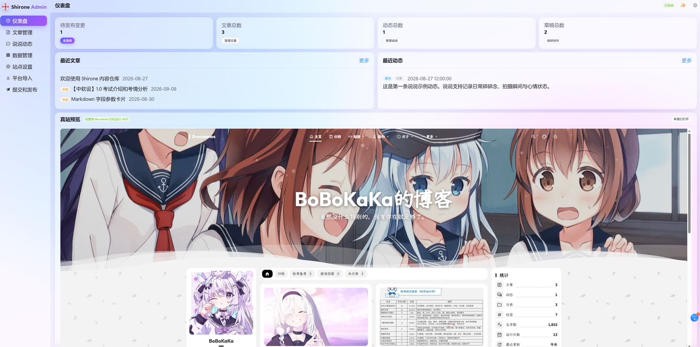
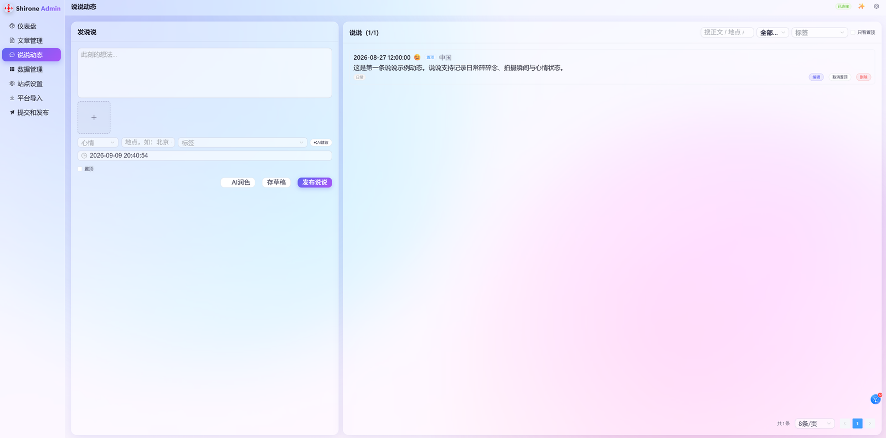

# Shirone-Admin

[Shirone](https://github.com/LyraVoid/Shirone) 博客的可视化内容管理工具：本地单机运行、前后端分离，直接读写 [Shirone-Content](https://github.com/LyraVoid/Shirone-Content) 内容仓，AI 辅助写作，一键双仓发布。





## 功能特性

- **文章编辑**：Markdown 源码模式编辑器（md-editor-v3），内置 Shirone 主题私有扩展片段（三冒号容器、file-tree、代码标签页、field 卡片等）；配图随文管理
- **说说/动态**：发布、图片自动归档到缩略图管线目录
- **结构化数据**：项目、技能、时间线、设备、番剧、导航、页脚等 `data/*.ts` 可视化编辑
- **站点配置**：YAML 最小化覆盖编辑，未声明字段继承主题默认值
- **AI 助手**：多服务商配置切换（Anthropic / OpenAI 兼容协议，支持中转代理），用于导入改写、提交信息生成、时间线起草、壁纸推荐、音乐联网搜索
- **内容导入**：简书导出包 / 单篇粘贴、番剧（Bangumi API）、音乐
- **一键发布**：双仓 git 提交与推送（内容仓 + 主题仓同步产物），发布前自动跑主题校验（`sync --dry-run`），提交信息自动生成
- **真站预览**：嵌入主题仓 `astro dev` 实时预览

## 工作区结构（三仓并列）

本工具不独立工作，需与 Shirone 主题仓、内容仓放在同一父目录：

```
blogs_ws/
├── Shirone/           博客主题（Astro 7 + Svelte 5，只读供校验与预览）
├── Shirone-Content/   内容仓（文章、说说、数据、配置——admin 唯一写入目标）
└── Shirone-Admin/     本仓库
```

- 主题仓：https://github.com/LyraVoid/Shirone
- 内容仓：https://github.com/LyraVoid/Shirone-Content

## 快速开始

前置要求：Node ≥ 22.12、pnpm ≥ 9（Windows 环境开发验证，PowerShell 下命令用 `.cmd` 后缀）。

```powershell
# 1. 三仓克隆到同一父目录
git clone https://github.com/LyraVoid/Shirone.git
git clone https://github.com/LyraVoid/Shirone-Content.git
git clone https://github.com/<你的用户名>/Shirone-Admin.git

# 2. 安装依赖（主题仓也要装，真站预览依赖它的 node_modules）
cd Shirone-Admin
pnpm.cmd install
cd ..\Shirone
pnpm.cmd install

# 3. 一键启动：内容仓监听同步 + 博客 dev(:4321) + Admin(server:5175 + client:5173)
cd ..\Shirone-Admin
node workspace/content-watch.mjs
```

三端就绪后统一打印地址：Admin 界面 http://localhost:5173 ，博客真站预览 http://localhost:4321 。

不配置 `.env` 时按上表相对位置自动解析两仓；路径不同或要改端口时，复制 `.env.example` 为 `.env` 修改。

## 环境变量

| 变量 | 说明 |
| --- | --- |
| `CONTENT_DIR` | 内容仓绝对路径（admin 唯一写入目标） |
| `THEME_DIR` | 主题仓绝对路径（校验 dry-run 与真站预览用） |
| `ADMIN_PORT` | API 端口，默认 5175 |
| `DEPLOY_HOST` | 部署目标，如 `user@your-server`（`node workspace/deploy.mjs` 用，SSH 免密需提前配置） |
| `DEPLOY_REMOTE_DIR` | 部署远端目录 |

## 架构与命令

```
client/   Vue 3 + Vite + Element Plus SPA（静态产物，可独立托管）
server/   Fastify 5 REST API（zod 校验、simple-git、sharp 图片处理）
shared/   API DTO 类型（纯类型，无运行时依赖）
```

pnpm workspace 单仓三包：

```powershell
node workspace/content-watch.mjs   # 一键：内容同步 + 博客 dev + Admin
pnpm.cmd dev                       # 只启动 Admin（server + client 并行）
pnpm.cmd type-check                # 全 workspace tsc --noEmit
pnpm.cmd build                     # client 产物在 client/dist
```

二期公网形态：换 Storage/Git 适配器实现 + nginx `/api` 反代，业务代码不动。

## 内容约定

- 文章：`content/posts/<slug>/index.md`，配图 `content/posts/<slug>/images/`
- 说说：`content/moments/*.md`，图片必须 `public/images/moments/<批次>/`（主题缩略图管线只扫此目录）
- 派生资源只读：`public/assets/moments/thumbnails/`、`public/assets/anime/covers/`、字体子集
- 提交信息由发布流自动生成：`type(scope): 中文 ≤30 字`

## 部署

`node workspace/deploy.mjs`：构建主题 → 压缩 `dist/` → 上传服务器 → 备份旧版 → 解压上线。配置见上表 `DEPLOY_HOST` / `DEPLOY_REMOTE_DIR`。

## 上游

基于 [LyraVoid/Shirone](https://github.com/LyraVoid/Shirone) 主题生态构建，上游持续开发中，可在各仓自行跟进合并。
